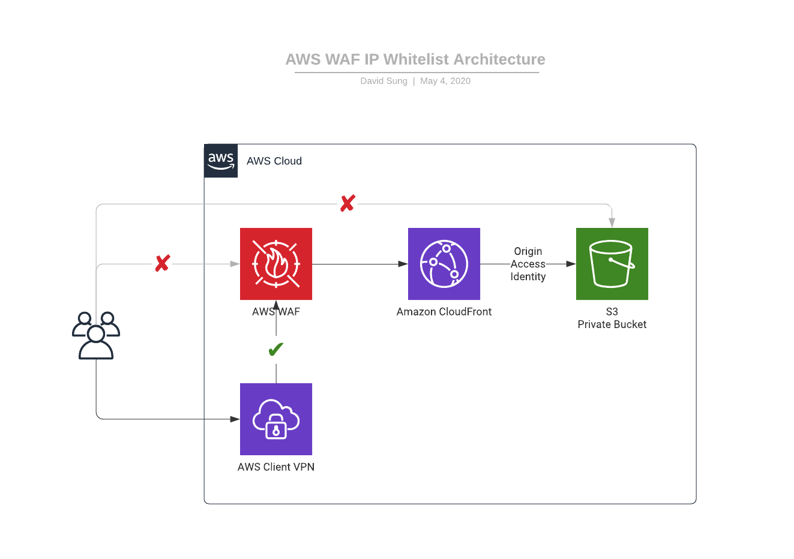

# Demonstration on using WAFv2 for IP Whitelisting in CF Distribution

This is a demo project for showcasing how to use WAFv2 IP Whitelisting feature to restrict a specific IP Address to access a CloudFront Distribution.



The `cdk.json` file tells the CDK Toolkit how to execute your app.

## Install AWS-CDK
```
npm install -g aws-cdk
```

## Deploy to environment
```
npm install
npm run build
cdk bootstrap
cdk deploy -c ip=<IP_ADDRESS_WITH_CIDR_BLOCK in the format of a.b.c.d/e where e is the prefix length>
```

## Useful commands

 * `npm run build`                                        compile typescript to js
 * `npm run watch`                                        watch for changes and compile
 * `npm run test`                                         perform the jest unit tests
 * `cdk deploy -c ip=<IP_ADDRESS_WITH_CIDR_BLOCK>`      deploy this stack to your default AWS account/region
 * `cdk diff -c ip=<IP_ADDRESS_WITH_CIDR_BLOCK>`        compare deployed stack with current state
 * `cdk synth -c ip=<IP_ADDRESS_WITH_CIDR_BLOCK>`       emits the synthesized CloudFormation template
